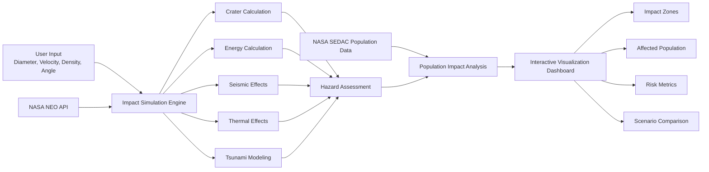
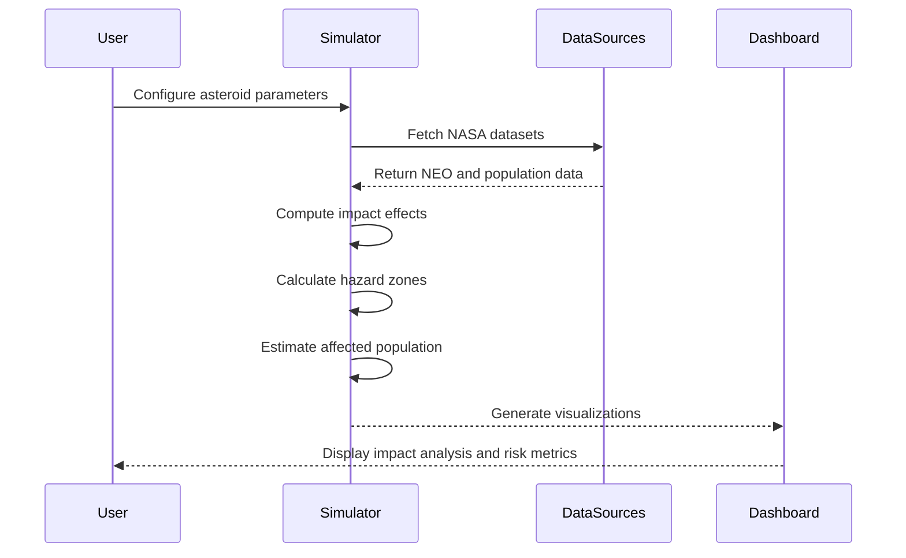

# Meteor Madness

Meteor Madness is a scientific simulation and visualization platform that models asteroid impact scenarios using real-world NASA and USGS datasets. The system allows users to configure asteroid characteristics such as diameter, velocity, density, and impact angle, then computes impact consequences through a physics-based simulation engine and visualizes the results on an interactive geospatial interface.

The platform integrates multiple external data sources, performs dynamic hazard calculations, and presents impact metrics including crater formation, kinetic energy release, seismic effects, thermal radiation zones, tsunami generation, and affected population estimates. Results are rendered through an interactive map-based dashboard, enabling users to explore and compare hypothetical planetary defense scenarios.

Designed as both an educational and decision-support tool, Meteor Madness demonstrates large-scale data integration, scientific computation, geospatial visualization, and interactive web application development.

---

## 🚀 Live Demo

https://nasa-smoky-theta.vercel.app/

---

## ✨ Key Features

### Physics-Based Impact Simulation

* Models asteroid impacts using established impact-effect equations
* Calculates crater dimensions, impact energy, thermal effects, seismic magnitude, and tsunami potential
* Supports configurable asteroid parameters including size, velocity, density, and impact angle

### Interactive Geospatial Visualization

* Displays impact locations and hazard zones on an interactive world map
* Visualizes blast radius, thermal damage zones, and affected regions
* Provides an intuitive interface for exploring impact scenarios

### Population Impact Analysis

* Integrates NASA SEDAC population density datasets
* Estimates potentially affected populations within hazard regions
* Enables risk assessment across different geographic locations

### Real-Time Scenario Exploration

* Dynamic parameter controls for rapid "what-if" analysis
* Instant recalculation and visualization of simulation results
* Supports comparative analysis of alternate impact conditions

### Multi-Source Data Integration

* Consumes NASA NEO datasets
* Integrates NASA SEDAC population density data
* Combines scientific simulation models with geospatial datasets

## Recognition

Developed as part of the NASA Space Apps Challenge to improve public understanding of planetary defense scenarios through interactive scientific simulations.

---

## 🛠️ Tech Stack

### Frontend
- HTML5
- CSS3
- JavaScript

### Scientific Computing
- Python
- Physics-Based Modeling
- Numerical Simulation

### Data Sources
- NASA NEO API
- NASA SEDAC Data
- Earth Impact Effects Model (Collins et al.)

### Deployment
- Vercel

 ## System Architecture

User Input
→ Impact Simulation Engine
→ Hazard Computation Layer
→ Population Impact Analysis
→ Interactive Visualization Dashboard

External Data Sources:
- NASA NEO API
- NASA SEDAC Population Data
- Earth Impact Effects Model

---

## 🔧 Engineering Highlights

### Scientific Simulation Engine
Implemented physics-based asteroid impact calculations to estimate crater size, impact energy, seismic effects, thermal radiation, and tsunami generation from user-defined asteroid parameters.

### Multi-Source Data Integration
Integrated NASA NEO and NASA SEDAC datasets to combine astronomical observations with population density analytics.

### Interactive Geospatial Visualization
Developed an interactive map-based interface for visualizing impact zones, affected regions, and population exposure estimates.

### Scenario Analysis Framework
Designed a configurable simulation workflow enabling users to explore and compare asteroid impact scenarios through dynamic parameter adjustment.

### Data-Driven Risk Assessment
Combined scientific simulation outputs with real-world demographic datasets to estimate potential human impact and improve interpretability of asteroid threats.

---

## Impact

* Converts complex planetary defense datasets into accessible visual simulations.
* Enables interactive exploration of asteroid impact scenarios.
* Demonstrates integration of scientific computation, geospatial visualization, and external APIs.
* Supports educational outreach and public awareness regarding asteroid risks.

---

## Data Sources

* NASA NEO API
* NASA SEDAC Population Density Data
* Earth Impact Effects Program (Collins et al., 2005)

---

## 🏗️ System Architecture

## ⚙️ Simulation Workflow

---

## 📄 License

This project is licensed under the MIT License.